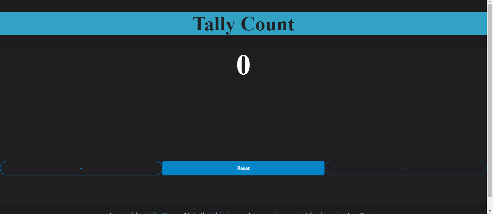

# Welcome to Tally Counter 👋

## Author:
Sumaiya Mohamed

## Title:
 Tally-Counter-App__Html__Css__Javascript

## Technologies used:
* HTML
* CSS
* Javascript
* Lit
* Shoelace

## Description: 
_Tally Counter App_ is an application that allows users to keep track of their counting wether it be positive or negative.

## Design:
https://www.figma.com/file/fmpEUp0BR0Z4RG0T1YcwHA/Tally-Count?type=design&mode=design&t=4CYseBXXDhiU3PSe-1

## Key Features:

1. **Increment the number** : Users can increase the number by clicking on the + button.

1. **Decrement the number** :
Users can decrease the number by clicking on the - button.

1. **Reset the number** : Users can reset the number displayed back to 0 which will allow them  to start counting from a fresh start.

1. **Message alert** : A message is displayed to tell the user if they have reached the maximum number or minimum number.
